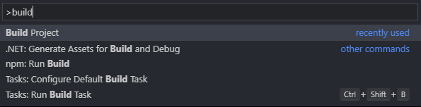

Dylan Support for Visual Studio Code
====================================

Contributions and further extensions are welcome!

---

# Features
- Syntax highlighting in Dylan project files
- Snippets for common macros and definitions
- Build and execute the current project from the command palette using the **Build Project** command. 

   

# Requirements
- VS Code 1.0
- To build projects from the command palette, you must have the [Open Dylan IDE](https://opendylan.org/download/index.html) installed locally, along with its depdendencies. 
Additionally: 
  - `dylan-compiler-with-tools(.exe)` must be included in your PATH.
  - `OPEN_DYLAN_USER_ROOT` must be configured as an environment variable
